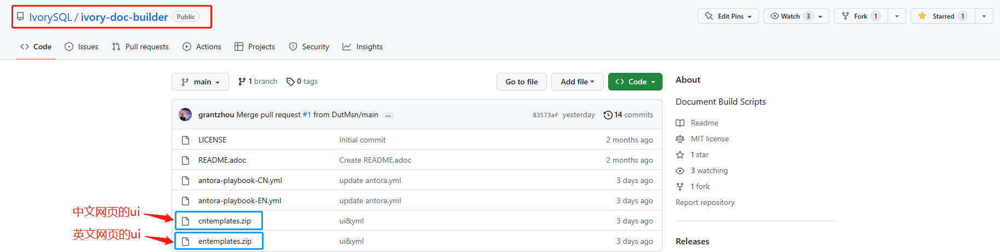

# Ivorysql_docs

[简体中文](./README_zh.md) | English

## Introduction

Welcome to the IvorySQL community documentation repository. This repository contains all documents presented at the [IvorySQL Documentation Center](https://docs.ivorysql.org), including release notes, getting started guides, advanced features, ecosystem, architecture design, Oracle compatibility feature list, community contribution guide, tool reference, FAQ, and more.

## Contributing

We warmly welcome your contributions to the documentation! If you'd like to participate, please read the [Contribution Scope](#contribution-scope), follow the [Writing Guidelines](#writing-guidelines), and submit according to the process rules. Once approved, your changes will appear on the community documentation center.

If you have any comments or suggestions about the documentation, please submit them in an Issue.

## Prerequisites

(1) Download the Asciidoc or Typora document editor.

(2) Check if the upstream repository has updates. If so, please sync to your own fork first:

```
git remote

git fetch upstream

git merge upstream/main

git push
```

(3) Familiarize yourself with the [Writing Guidelines](#writing-guidelines).

## Contribution Scope

IvorySQL community provides bilingual documentation. English documents are stored in `EN/` and Chinese documents in `CN/`. You can contribute to either or both.

You can start with any of the following to help improve the documentation at [IvorySQL Documentation Center](https://docs.ivorysql.org):

- (1) Write and improve documentation
- (2) Fix typos or formatting issues (punctuation, spaces, indentation, code blocks, etc.)
- (3) Correct or update inaccurate or outdated descriptions
- (4) Add missing content (sentences, paragraphs, or new documents)
- (5) Translate documentation changes from English to Chinese, or from Chinese to English
- (6) Submit, reply to, and resolve documentation issues
- (7) (Advanced) Review pull requests created by others

## Writing Guidelines

IvorySQL documentation is written in AsciiDoc. Please refer to the [adoc syntax quick reference](./adoc_syntax_quick_reference.md) for details.

## Local Site Generation

With the above preparation, you can contribute to the documentation and push to your personal ivorysql_docs fork.

You may also want to know the location of the UI templates, as shown below:



The web UI templates for Chinese and English are mostly identical, so modifications should be made to both templates simultaneously.

If you have made extensive changes to the documentation, it is recommended to preview locally before submitting a PR. The steps are as follows:

### Environment Setup

Install Node.js (requires v16 or higher, v18+ recommended):
```
# Using nvm (recommended)
curl -o- https://raw.githubusercontent.com/nvm-sh/nvm/v0.39.7/install.sh | bash
source ~/.bashrc
nvm install 18
nvm use 18
```

Install Ruby and Asciidoctor PDF:
```
sudo apt-get install -y ruby-full
gem install asciidoctor-pdf --version "~>2.3.19"
gem install rouge
```

Install Antora and extensions:
```
npm install
```

Verify installation:
```
npx antora -v
```

### Build Steps

The documentation site is built with `Antora`. The `ivory-doc-builder` repository is responsible for compilation:

- `fork` the [ivory-doc-builder repository](https://github.com/IvorySQL/ivory-doc-builder)
- `clone` the repository locally:

  `git clone https://github.com/yourname/ivory-doc-builder.git`

- Run the build:

  ```
  npm run build:cn   # Build Chinese site
  npm run build:en   # Build English site
  npm run build:all  # Build both
  ```

  Wait patiently. When it finishes successfully, you can find the generated site in `../www_publish_target/docs/`.

After reviewing, you can submit a [PR](https://github.com/IvorySQL/ivorysql_docs). Thank you for your contribution to the community ^ _ ^ We will review and update the website accordingly.

## Autobuild

Every PR submitted to the ivorysql_docs repository will generate Chinese and English Deploy Preview links in the PR conversation. Click the link to preview the changes.
