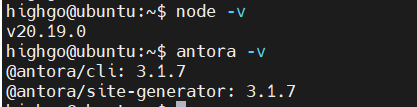

# Ivorysql_docs  

简体中文 | [English](./README.md)

## 介绍

欢迎来到IvorySQL社区文档的仓库。此仓库提供[IvorySQL文档中心](https://docs.ivorysql.org/cn/index.html)呈现的所有文档，包括发行说明、IvorySQL入门、IvorySQL高级、IvorySQL生态、IvorySQL架构设计、Oracle兼容功能列表、社区贡献指南、工具参考、FAQ等内容。
## 贡献

我们非常欢迎您贡献文档！如果想要参与，请阅读[贡献范围](#贡献范围)、遵守文档写作[规范说明](#规范说明)、按照流程规则提交。审核通过后，修改会在社区的文档中心中呈现。

同时，如果您对文档有任何意见或建议，请在Issue中提交。

## 准备工作

（1）下载Asciidoc或者Typora文档编辑器。

（2）检查源仓库是否有更新，如果有更新请先更新并同步到自己的仓库。如有更新请参阅以下步骤，更新至最新版本：

```
git remote

git fetch upstream

git merge upstream/main

git push
```

（3）熟悉[文档写作规范](#规范说明)

## 贡献范围

IvorySQL社区提供双语文档。英文文档保存在EN/中，中文文档保存在CN/中。您可以为任何一方文档做出贡献，当然您也可以为两方同时做出贡献。

​    您可以从以下任何一项开始，以帮助改进[IvorySQL文档中心](https://docs.ivorysql.org)上的文档：

​        (1) 编写完善文档

​        (2) 修复拼写错误或格式（标点符号、空格、缩进、代码块等）

​        (3) 修正或更新不当或过时的说明

​        (4) 添加缺少的内容（句子、段落或新文档）

​        (5) 将文档更改从英文翻译成中文，或从中文翻译成英文。

​        (6) 提交、回复和解决文档问题

​        (7) （高级）查看其他人创建的拉取请求

## 规范说明

IvorySQL文档是用“asciidoc”编写，具体请参考[adoc规范](./adoc_syntax_quick_reference.md)。

## 本地网页生成
通过之前的内容，您就可以进行文档贡献，最终push到您个人的ivorysql_docs仓库中。

另外，您可能需要知道网页对应的ui的位置，如下图：


中英文的网页ui模板基本一致，因此修改时应该尽量保证同时修改两个模板。

如果您文档贡献修改的内容较多，建议在提交PR前，先在本地进行预览，具体步骤如下：

### 环境准备

安装Node.js
```
sudo yum install -y nodejs
sudo npm install -g serve@14.2.4
```
安装Antora
```
npm install  antora@3.1.7
npm install @antora/pdf-extension
npm install @antora/lunr-extension
npm install nodejieba
npm install @asciidoctor/core asciidoctor-pdf
npx antora -v
alias antora='npx antora' #将npx antora更名为antora
antora -v
```
最终，在终端上显示如下即为成功安装。




### 编译步骤

文档中心是由 `Antora` 进行搭建的，doc-builder仓库负责编译：
* `fork` [doc-builder仓库](https://github.com/IvorySQL/ivory-doc-builder)
* `clone` doc-builder仓库到本地

    `git clone https://github.com/yourname/ivory-doc-builder.git`
* doc-builder 编译

    `antora generate --to-dir ../demo antora-playbook-CN.yml --stacktrace`

    然后耐心等待，当成功运行结束后，你就可以到../demo 中查看自己生成的网页了。

检查之后，你就可以开始提交[PR](https://github.com/IvorySQL/ivorysql_docs/blob/v4.6/CN/modules/ROOT/pages/v4.6/32.adoc)，感谢您对社区的贡献^ _ ^，我们会在审核过后，考虑是否更新网站。

## Autobuild

在Ivorysql-docs的仓库中提交的每一个PR, PR会话中会分别产生中文/英文的Deploy Preview链接，点击链接即可实现预览。
